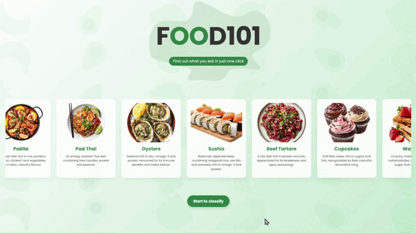

# Food Classification and Nutritional Estimation  

## Overview  
This project implements an **AI-driven food classification** system that identifies food items from images and estimates their **nutritional content**. The system is designed for applications in **dietary tracking, health monitoring, and nutrition management**.  

## How It Works  
1. **Model Selection** – Users can choose from **EfficientNetV2B2, InceptionV3, or a CNN** for classification.  
2. **Image Upload** – Users upload a food image via the web interface.  
3. **Classification** – The model predicts the food category with a confidence score.  
4. **Nutritional Estimation** – The system retrieves nutritional values (calories, fat, carbs, protein) based on USDA’s **Food Data Central**.  

## Technology Stack  
- **Deep Learning Models:** CNNs, EfficientNetV2B2, InceptionV3  
- **Machine Learning Models:** Decision Tree, Random Forest  
- **Dataset:** Food-101, USDA Food Data Central  
- **Backend:** Python 
- **Frontend:** HTML, CSS, JavaScript (React)

## Key Features  
- **Accurate Food Classification** using transfer learning  
- **Nutritional Information Retrieval** for each classified food  
- **User-friendly Web Interface** for easy image uploads and predictions  
- **Model Comparison** with traditional classifiers (Random Forest, Decision Trees)  

---
**Web Interface:**  

## Authors
Project done during AI MSc at University of Kent for AI Sytems Implementation module.

- **Isabelle Bricaud : CNN, All Web Application, JSON file**
- Suchi Prommuangkun : InceptionV3
- Napatchol Thaipanich : EfficientNet
- Alfred Ogunbayo : Decision Tree
- Priscilla Baiya : Random Forest
